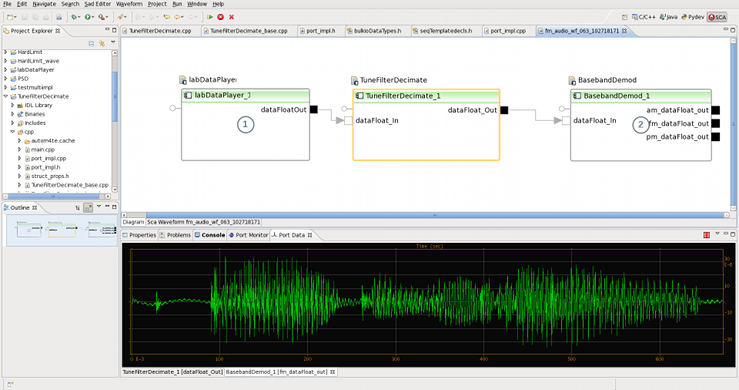

# REDHAWK

## Description
REDHAWK is a software-defined radio (SDR) framework designed to support the development, deployment, and management of real-time software radio applications. To support the design and development of software applications, REDHAWK provides tools that allow development and testing of software modules called "Components" and composition of Components into "Waveform Applications" that can be seamlessly deployed on a single computer or multiple network-enabled computers.

The REDHAWK integrated development environment (IDE) provides tools to support development of REDHAWK software. The development and deployment of REDHAWK Applications are aided by graphical editors and drag-and-drop Waveform construction. The IDE allows users to interact with and control multiple running REDHAWK instances and applications.

## Recent Announcements

### **[Release of REDHAWK 2.2.3](https://github.com/redhawksdr/redhawk/releases/tag/2.2.3) (June 2019)**
The effort in REDHAWK 2.2.3 focused on:

* Adding a note in the REDHAWK Manual about compiling REDHAWK with newer versions of GCC that default to the C++11 standard.
* Adding code to `DomainEventReader` to recognize and handle object-removed events.
* Adding the Querying and Configuring Components and Devices section in the REDHAWK Manual to include instructions on how to interact with properties from programs in C++, Java, or Python.
* Resolving a missing symbol issue for C++ `bulkio::SampleDataBlock::copy()` methods.
* Improving how `gpp_setup` responds to the host processor. If the processor cannot be determined, user input is requested.  
Adding the section, Setting Host Architecture/Computer Processor Name, to the Troubleshooting appendix of the REDHAWK Manual.
* Correcting the Domain Manager's behavior when a DCD has an improperly-defined connection (for example, an incorrect port name) between a device and a service. The Domain Manager now correctly completes all other valid connections defined in the DCD.
* Correcting the Device Manager's behavior to successfully reconnect with the Domain Manager in the event that the Domain Manager has to be reset.
* Modifying the `getPacket` function in Java to limit logging, which allows garbage collection to keep up when the argument in `getPacket` is set to zero.
* Resolving the following issues related to shared memory transport:
 * Rapidly stopping and restarting components with BulkIO shared memory connections could lead to crashes or aborts. 
 * Incorrect display of owner PID for shared memory heaps in `redhawk-shminfo`.
* Resolving issue within the `ProcessThread` base class in C++ to take into account an updated delay value.
* Providing the following updates related to generating a component using `createOctaveComponent`: 
 * The contents of the SCD file are generated by inspecting the ports to list the interfaces.
 * The contents of the `SoftPkg ID` is based on a `DCE:<uuid>` instead of the m-file.
* Correcting behavior when an allocation of an FEI device fails. The `frontend_tuner_status` is not updated with the failed allocation's values.

## Copyrights
This work is protected by Copyright. Please refer to the [Copyright File](COPYRIGHT) for updated copyright information.
